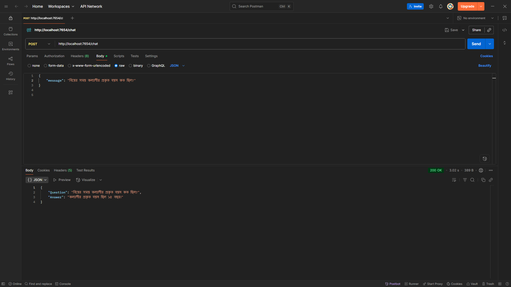

# HSC AI Assistant: Educational Q&A System



## Project Overview

**HSC AI Assistant** is a multilingual educational chatbot designed specifically for Higher Secondary Certificate (HSC) students, built for **10 Minute School**. This intelligent assistant provides reliable answers from curated educational documents in both **Bangla and English**. The system runs on Flask with a sophisticated retrieval-augmented generation (RAG) pipeline powered by **LLaMA3-70B via Groq API**, ensuring contextual responses for HSC-level queries.

---

🌟 **Key Features**

* **Multilingual Support**: Seamless Bangla and English processing
* **Context Awareness**: Maintains conversation history for better responses
* **Sentence-level Chunking**: Optimized for educational content with semantic integrity preservation
* **Language Consistency**: Responds in the same language as the query
* **Educational Focus**: Tailored prompting for academic content
* **Scalable Architecture**: Serverless Pinecone deployment for reliability

---

🔍 **How It Works**

1. **Educational Content Processing**
   * Education related PDF documents are uploaded and parsed using LangChain's PDFPlumberLoader
   * Content is cleaned and optimized for Bangla and English text processing

2. **Intelligent Chunking & Embedding**
   * Text data is semantically chunked using sentence-level splitting for optimal coherence
   * Special consideration for Bangla punctuation (।, ॥) to maintain proper sentence boundaries
   * Multilingual embeddings using HuggingFace's `paraphrase-multilingual-MiniLM-L12-v2` model
   * Sentence-based chunking ensures semantic integrity for smaller PDF documents

3. **Vector Storage in Pinecone**
   * Embeddings are stored in **Pinecone Vector DB** with cosine similarity
   * Semantic index built for efficient similarity-based search across languages

4. **Real-Time Query Flow**
   * Students submit queries in Bangla or English via Flask API
   * Query language is automatically detected
   * Top 7 relevant chunks are retrieved and processed using LLaMA3
   * Responses maintain the same language as the query with proper grammar

---

⚙️ **Workflow Summary**

```
HSC PDFs → Text Cleaning → Sentence-based Chunks → Embeddings → Pinecone Index
                                                                       ↓
                  Query (Bangla/English) → Language Detection → Knowledge Base
                                                                       ↓
                                                              Ranked Results → Groq LLM → Answer
```

---

🔧 **Key Technologies**

* **Backend**: Python (Flask, LangChain, Groq API, Pinecone, HuggingFace)
* **Vector Database**: Pinecone (AWS us-east-1, Serverless)
* **Embedding Model**: paraphrase-multilingual-MiniLM-L12-v2 (384 dimensions)
* **LLM**: Groq LLaMA3-70B-8192 (Temperature: 0.5)
* **Document Processing**: PDFPlumber for reliable PDF text extraction
* **Memory Management**: Conversation history (10 exchanges)

---

📦 **Setup Instructions**

1. **Clone the Repository**
```bash
git clone https://github.com/AnthropoidFHJ/HSC-AI-Assistant.git
cd hsc-ai-assistant
```

2. **Create Python Environment**
```bash
python -m venv venv

#Linux/macOS:
source venv/bin/activate

#Windows: 
Windows: venv\Scripts\activate
```

3. **Install Requirements**
```bash
pip install -r requirements.txt
```

4. **Configure Environment Variables**
Create a `.env` file in the root directory:
```env
PINECONE_API_KEY="Your_Pinecone_API_Key"
GROQ_API_KEY="Your_Groq_API_Key"
```

5. **Run the Application**

##### → Method 1: Run using main.py #####
```bash
python main.py
```

##### → Method 2: Run individual scripts #####
```bash
python store_index.py  
python app.py 
```

Visit: [http://localhost:7654](http://localhost:7654)

---

💬 **API Endpoints**

**➤ Postman Configuration**

##### Health Check Endpoint: #####
- **Method:** GET
- **URL:** `http://localhost:7654/`

**Output:**
```
Server is running. please use the /chat endpoint to interact.
```

##### Chat Endpoint: #####
- **Method:** POST
- **URL:** `http://localhost:7654/chat`

  ```
  Content-Type: application/json
  ```
- **Body:** 
  - Select **raw**
  - Select **JSON** from dropdown
  - Input:
  ```json
  {
    "message": "রবীন্দ্রনাথ ঠাকুর কখন জন্মগ্রহণ করেন?"
  }
  ```

**Output:**
```json
  {
  "Question": "রবীন্দ্রনাথ ঠাকুর কখন জন্মগ্রহণ করেন?",
   "Answer" : "রবীন্দ্রনাথ ঠাকুর ১৮৬১ সালে জন্মগ্রহণ করেন।"
   }
```

---

📖 **Usage Examples**

**Bangla Query:**
```
Question: "বিয়ের সময় কল্যাণীর প্রকৃত বয়স কত ছিল?"
Answer: "কল্যাণীর প্রকৃত বয়স ছিল ১৫ বছর।"
```

**English Query:**
```
Question: "When was Rabindranath Tagore born?"
Answer: "Rabindranath Tagore was born in 1861."
```

---

🧪 **Development History**

* **Research Phase**: Content analysis and multilingual requirements gathering
* **Architecture Design**: RAG pipeline design with multilingual considerations
* **Development**: Flask API with conversation memory and language detection
* **Optimization**: Switched to sentence-level chunking for improved semantic coherence with smaller PDFs
* **Testing**: Validation with Bangla and English content
---

🔮 **Future Enhancements**

* Add **Streamlit/React Frontend** for better student experience
* Implement **Subject-wise Categorization** (Physics, Chemistry, Math, etc.)
* Add **Practice Question Generation** from content
* Integrate **Voice Input/Output** for accessibility
* Add **Multi-document Citation** tracking
* Optimize **Chunking Strategy** for larger documents with hybrid approaches

---

**This project was developed as part of a technical assessment for 10 Minute School, focusing on enhancing HSC students' learning experiences through an AI-powered, multilingual educational assistant.**

---

**Author:** Ferdous Hasan  
**Date:** July 25, 2025
